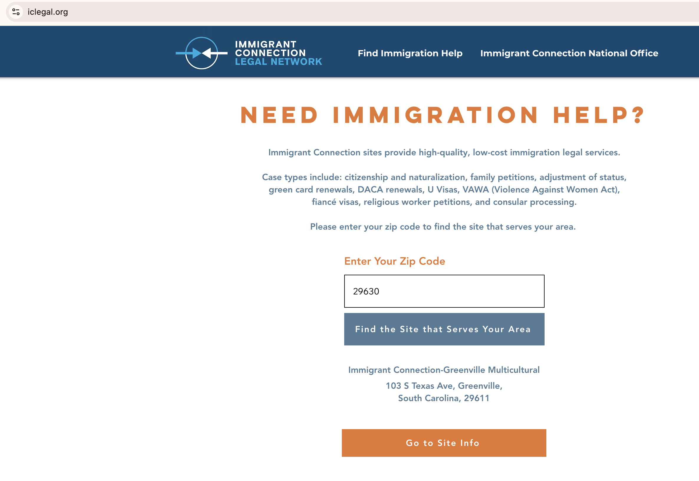

# Immigrant Connection ZIP Code Mapping System

## Documentation for AI Assistants & Developers

This document provides comprehensive documentation of the Immigrant Connection ZIP code mapping and location routing system built on Wix. It contains all information necessary to understand, maintain, or extend the system.

---

## Table of Contents

1. [System Overview](#system-overview)
2. [Interface Visual Reference](#interface-visual-reference)
3. [Architecture](#architecture)
4. [Files Reference](#files-reference)
5. [Data Model](#data-model)
6. [Detailed Component Documentation](#detailed-component-documentation)
7. [Data Flow Diagrams](#data-flow-diagrams)
8. [API Reference](#api-reference)
9. [Key Technical Decisions](#key-technical-decisions)
10. [External Dependencies](#external-dependencies)
11. [Quick Reference](#quick-reference)

---

## System Overview

### Purpose

This system allows **Immigrant Connection** (a network of immigration legal services locations across the US) to:

1. **Assign ZIP codes to locations** - Admins visually assign ZIP code regions to specific IC locations using an interactive map
2. **Route callers to appropriate locations** - Call center staff enter a caller's ZIP code to find the nearest/appropriate IC location
3. **Enable external sites to perform lookups** - External sites (like iclegal.org) can query the system via API to direct potential clients

### Key Concepts

- **ZIP3 vs ZIP5**: The system supports both 3-digit (regional) and 5-digit (specific) ZIP code assignments
- **Priority**: ZIP5 assignments always override ZIP3 assignments for the same area
- **Pipe-separated storage**: ZIP codes are stored as pipe-delimited strings (e.g., `"480|481|49503|495"`)

### Sites Involved

| Site | Role | Branding |
|------|------|----------|
| **icpartners.org** | Main Wix site hosting the database, admin tools, call center lookup, and API | "IMMIGRANT CONNECTION" |
| **iclegal.org** | External consumer site that queries the API and maps results to local pages | "IMMIGRANT CONNECTION LEGAL NETWORK" |

> **Data Consistency**: All interfaces (admin mapper, Amazon lookup, iclegal.org) query the same `Import1` collection, ensuring a user entering ZIP `29630` receives the same result ("Immigrant Connection-Greenville Multicultural") regardless of which interface they use.

### Design Language

All interfaces share a consistent visual style with blue/teal accent colors and similar button styles, while maintaining site-specific branding and messaging tailored to each audience (corporate partners, call center staff, public consumers).

---

## Interface Visual Reference

### Interface 1: iclegal.org - External Consumer Lookup

**URL**: `https://iclegal.org`



**Description**:
- **Branding**: "IMMIGRANT CONNECTION LEGAL NETWORK" (distinct from icpartners.org branding)
- **Header**: "NEED IMMIGRATION HELP?"
- **UI Components**:
  - Blue "Enter Your Zip Code" label
  - Text input field (shows "29630" in example)
  - Dark teal "Find the Site that Serves Your Area" button
  - Result displays location name and full address
  - Orange "Go to Site Info" button (links to internal iclegal.org page via `LocalICSites` mapping)

**Example Result Shown**:
- ZIP: `29630`
- Location: "Immigrant Connection-Greenville Multicultural"
- Address: "103 S Texas Ave, Greenville, South Carolina, 29611"

**Technical Notes**:
- Uses `remoteSearchByZipPageCode.js`
- Calls icpartners.org API with API key authentication
- Maps result to internal iclegal.org URL via `LocalICSites` collection

---

### Interface 2: icpartners.org/amazon-lookup - Corporate Partner Lookup

**URL**: `https://icpartners.org/amazon-lookup`


**Description**:
- **Title**: "Amazon Associate Zip Lookup"
- **Purpose**: Dedicated page for Amazon employees (corporate partnership program)
- **Messaging**: Explains that Amazon partnered with IC to provide immigration services to foreign-born employees
- **UI Components**:
  - Text input field for ZIP code
  - "Look Up >" button
  - Result displays location name prominently
  - Location image displayed (church building photo)
  - "Book on Site Calendar >" button (links directly to `calendarUrl`)

**Example Result Shown**:
- ZIP: `29630`
- Location: "Immigrant Connection-Greenville Multicultural"
- Image: Church building with white steeple

**Technical Notes**:
- Uses `CallCenterLookUpPageCode.js` (or similar variant)
- Direct backend call to `findLocationByZip()` 
- Shows location image from `imageUrl` field
- Calendar button links to external Acuity scheduling

**Important Context**: 
This page exists because of a corporate partnership between Amazon and Immigrant Connection. Amazon employees can use this tool to find immigration legal services in their area. This is separate from the general public-facing lookup.

---

### Interface 3: icpartners.org/call-center-mapper - Admin ZIP Assignment Tool

**URL**: `https://icpartners.org/call-center-mapper`


**Description**:
- **Purpose**: Administrative tool for assigning ZIP codes to locations
- **Map Features**:
  - Interactive Leaflet.js map of continental US
  - Color-coded ZIP3 regions (each location has unique color)
  - Location markers as colored circles with black borders
  - ZIP Resolution slider (set to "3" in screenshot)
  - Zoom controls (+/-)
  - OpenStreetMap attribution visible

**Visible Locations in Screenshot**:
The location list below the map shows assigned ZIP codes for each location:

| Location | Sample ZIP Codes Assigned |
|----------|---------------------------|
| Immigrant Connection at Northwest Iowa | 505, 510, 511, 512, 513, 515, 561, 570-577, 580-588, 680, 681, 686, 687, 692 |
| Immigrant Connection at Clearwater | 320-331, 333-339, 341, 342, 344, 346, 347, 349 |
| Immigrant Connection at Awaken City | 010-088, 100-149, 165, 180-194 (entire Northeast region) |
| Immigrant Connection at Table Church | (visible but ZIP list cut off) |

**Visual Observations**:
- **Color Distribution**: Map shows approximately 25+ distinct colors representing different locations
- **Regional Coverage**: Locations have broad regional coverage using ZIP3 codes
- **Northeast Coverage**: "Awaken City" covers extensive Northeast territory (nearly 100 ZIP3 codes)
- **Marker Placement**: Markers accurately placed at location lat/long coordinates
- **List Format**: Each location shows colored left border matching its map color

**Technical Notes**:
- Uses `callCenterMapperPageCode.js` + `htmlMapIframeCode.html`
- GeoJSON boundaries fetched from Wix Media CDN
- Resolution slider toggles between ZIP3 (3) and ZIP5 (5)
- Click interaction: Select location from list, then click map region to toggle assignment

---

## Architecture

### High-Level System Diagram

```
┌──────────────────────────────────────────────────────────────────────────────────────────┐
│                               icpartners.org (Wix Site)                                  │
├──────────────────────────────────────────────────────────────────────────────────────────┤
│                                                                                          │
│  ┌──────────────────────────────────────────────────────────────────────────────────┐   │
│  │                            Import1 Collection                                     │   │
│  │  • name, address, telephone, email, website, hours                               │   │
│  │  • latitude, longitude, imageUrl, category                                       │   │
│  │  • referringZips: "480|481|49503|..." (pipe-separated ZIP3 & ZIP5)               │   │
│  │  • calendarUrl, contactPreference                                                │   │
│  └──────────────────────────────────────────────────────────────────────────────────┘   │
│                                          │                                               │
│  ┌───────────────────────────────────────┴────────────────────────────────────────────┐ │
│  │                     Wix Media (User Files CDN)                                     │ │
│  │  ZIP3 GeoJSON: 502226_607f9c6b831d4302a2f993ac0d3fcb1b.json                        │ │
│  │  ZIP5 GeoJSON: 502226_2549809086954acebd6ec068454354e8.json                        │ │
│  └────────────────────────────────────────────────────────────────────────────────────┘ │
│                                          │                                               │
│    ┌─────────────────┬───────────────────┼───────────────────┬─────────────────┐        │
│    │                 │                   │                   │                 │        │
│    ▼                 ▼                   ▼                   ▼                 │        │
│  ┌───────────┐  ┌────────────────┐  ┌──────────────┐  ┌─────────────────┐     │        │
│  │  ADMIN    │  │ AMAZON/CALL    │  │   HTTP API   │  │  zipLookup.jsw  │     │        │
│  │  MAPPER   │  │ CENTER LOOKUP  │  │              │  │  (Backend)      │     │        │
│  │           │  │                │  │              │  │                 │     │        │
│  │ /call-    │  │ /amazon-lookup │  │ /_functions/ │  │ findLocation-   │     │        │
│  │ center-   │  │                │  │ get_location │  │ ByZip()         │◄────┘        │
│  │ mapper    │  │ For Amazon     │  │ ByZip        │  │                 │              │
│  │           │  │ employees &    │  │              │  │ ZIP5 → ZIP3     │              │
│  │ Leaflet   │  │ call center    │  │ API key      │  │ fallback logic  │              │
│  │ map +     │  │ staff          │  │ protected    │  │                 │              │
│  │ iframe    │  │                │  │              │  │                 │              │
│  └───────────┘  └───────┬────────┘  └──────┬───────┘  └─────────────────┘              │
│                         │                  │                                            │
│                         └──────────────────┤                                            │
│                                            │                                            │
└────────────────────────────────────────────┼────────────────────────────────────────────┘
                                             │
                                             │ HTTPS + API Key
                                             ▼
                                ┌─────────────────────────────────┐
                                │         iclegal.org             │
                                │   "LEGAL NETWORK" branding      │
                                │                                 │
                                │   External consumer lookup      │
                                │   + LocalICSites collection     │
                                │   (maps names → internal URLs)  │
                                └─────────────────────────────────┘
```

### Four Interfaces

1. **Admin Mapper** (`/call-center-mapper`) - Visual map-based tool for assigning ZIP codes to locations
2. **Call Center/Amazon Lookup** (`/amazon-lookup`) - Internal lookup for call center staff and Amazon employees
3. **HTTP API** (`/_functions/get_locationByZip`) - REST endpoint for external sites to query location data
4. **External Consumer** (iclegal.org) - Public-facing lookup that consumes the API

---

## Files Reference

### File Inventory

| File | Type | Purpose | Location in Wix |
|------|------|---------|-----------------|
| `callCenterMapperPageCode.js` | Wix Velo | Admin mapper page code | Page Code |
| `htmlMapIframeCode.html` | HTML/JS | Interactive Leaflet map (iframe) | HTML Component |
| `CallCenterLookUpPageCode.js` | Wix Velo | Call center lookup page code | Page Code |
| `zipLookup.jsw` | Wix Backend | ZIP lookup business logic | Backend (.jsw) |
| `http-functions.js` | Wix Backend | HTTP API endpoints | Backend (http-functions.js) |
| `remoteSearchByZipPageCode.js` | Wix Velo | iclegal.org lookup page code | Page Code (on iclegal.org) |
| `zip3-us.json` | GeoJSON | US ZIP3 boundaries | Wix Media |
| `zip5-us.json` | GeoJSON | US ZIP5 boundaries | Wix Media |
| `IC+Locations+For+Call+Center+Lookup.csv` | CSV | Sample data export | Reference only |

### File Details

#### 1. `callCenterMapperPageCode.js` (76 lines)

**Purpose**: Wix page code for the admin ZIP assignment interface.

**Key Functionality**:
- Queries `Import1` collection on page load
- Sends site data to iframe via `postMessage()`
- Listens for `zip3MapUpdate` messages from iframe
- Updates `referringZips` field in collection when assignments change

**Key Code Sections**:
```javascript
// Send data to iframe
mapElement.postMessage({ type: "initMap", sites: siteData, initialMap: zipMap });

// Listen for updates from iframe
$w("#htmlMap").onMessage((event) => {
  const { type, zip3Map } = event.data;
  if (type === "zip3MapUpdate") {
    // Update Import1 collection with new assignments
  }
});
```

#### 2. `htmlMapIframeCode.html` (246 lines)

**Purpose**: Interactive Leaflet.js map embedded in Wix HTML component.

**Key Functionality**:
- Renders US map with ZIP code boundaries
- Allows toggling between ZIP3 and ZIP5 resolution
- Click regions to assign/unassign to selected location
- Color-codes regions by assigned location
- Shows location markers with tooltips

**GeoJSON URLs (Wix Media)**:
```javascript
const fileMap = {
  3: "https://502226b4-110a-4861-ad7e-941df81678ff.usrfiles.com/ugd/502226_607f9c6b831d4302a2f993ac0d3fcb1b.json",
  5: "https://502226b4-110a-4861-ad7e-941df81678ff.usrfiles.com/ugd/502226_2549809086954acebd6ec068454354e8.json"
};
```

**Key Functions**:
- `loadGeoJSON(res)` - Fetches and renders GeoJSON for ZIP3 or ZIP5
- `updateVisibleGeoJSONLayers()` - Manages layer visibility based on resolution
- `postZipMapToParent()` - Sends updates to parent Wix page
- `style(feature)` - Determines fill color based on assignments
- `onEachFeature(feature, layer)` - Handles click events for assignment

#### 3. `CallCenterLookUpPageCode.js` (73 lines)

**Purpose**: Simple lookup interface for call center staff.

**Key Functionality**:
- Takes 5-digit ZIP input
- Calls backend `findLocationByZip()` function
- Displays location name, image, calendar URL, phone, contact preference

**UI Elements**:
- `#zipInput` - Text input for ZIP code
- `#searchButton` - Triggers lookup
- `#resultText` - Displays location name
- `#resultImage` - Displays location image
- `#buttonCalendarURL` - Link to booking calendar
- `#resultLinkText` - Shows phone (fallback)
- `#contactPref` - Shows "Please Call" or "Please Text"

#### 4. `zipLookup.jsw` (52 lines)

**Purpose**: Backend web module containing core ZIP lookup logic.

**Key Function**:
```javascript
export async function findLocationByZip(inputZip) {
  const zip5 = inputZip;
  const zip3 = inputZip.slice(0, 3);

  // Query for matches containing either ZIP5 or ZIP3
  const allMatches = await wixData.query("Import1")
    .contains("referringZips", zip5)
    .or(wixData.query("Import1").contains("referringZips", zip3))
    .find();

  // Priority 1: Exact ZIP5 match
  const zip5Matches = allMatches.items.filter(item => {
    const zips = (item.referringZips || "").split('|');
    return zips.includes(zip5);
  });
  if (zip5Matches.length > 0) return { matchType: "ZIP5", ... };

  // Priority 2: ZIP3 fallback
  const zip3Matches = allMatches.items.filter(item => {
    const zips = (item.referringZips || "").split('|');
    return zips.includes(zip3);
  });
  if (zip3Matches.length > 0) return { matchType: "ZIP3", ... };

  return null;
}
```

**Return Object**:
```javascript
{
  matchType: "ZIP5" | "ZIP3",
  location: string,      // Location name
  address: string,
  website: string,
  imageUrl: string,
  phone: string,
  contactPref: string,   // "Please Call" or "Please Text"
  calendarUrl: string
}
```

#### 5. `http-functions.js` (121 lines)

**Purpose**: HTTP API endpoints for external access.

**Endpoint**: `GET /_functions/get_locationByZip`

**Query Parameters**:
- `zip` (required) - 5-digit ZIP code
- `apiKey` (required) - Authentication key

**Security**:
- API key validation (hardcoded key)
- Key can be passed via query param or `X-API-Key` header
- Returns 403 if invalid/missing

**API Key**:
```javascript
const API_KEY = '4c77ad03db988e4e2820a49753f0811b06ef3833a6e10858bd69a30686211742';
```

**Response Format**:
```json
{
  "matchType": "ZIP5",
  "location": "Immigrant Connection at Kentwood Community Church",
  "address": "1200 60th St SE, Grand Rapids, Michigan, 49508",
  "website": "https://kentwoodcommunitychurch.com/immigrant-connection",
  "imageUrl": "https://static.wixstatic.com/...",
  "phone": "616-455-1740",
  "contactPref": "Please Call",
  "calendarUrl": "https://immigrantconnectionatkentwoodcommunitychurch.as.me/...",
  "timestamp": 1702900000000,
  "cached": false
}
```

#### 6. `remoteSearchByZipPageCode.js` (189 lines)

**Purpose**: Frontend code for iclegal.org (external consumer site).

**Key Functionality**:
- Calls icpartners.org API with ZIP and API key
- On successful result, queries local `LocalICSites` collection
- Maps external location name to internal iclegal.org URL
- Falls back to showing phone/contact info if no local mapping exists

**API Call**:
```javascript
const API_URL = 'https://www.icpartners.org/_functions/get_locationByZip';
const url = `${API_URL}?zip=${zip}&apiKey=${encodeURIComponent(API_KEY)}`;
```

**Local Mapping Logic**:
```javascript
const localSiteQuery = await wixData.query("LocalICSites")
  .eq("mapperName", result.location)
  .find();

if (localSiteQuery.items[0].url) {
  $w('#buttonCalendarURL').link = localSiteQuery.items[0].url;
}
```

---

## Data Model

### Import1 Collection (icpartners.org)

| Field | Type | Description | Example |
|-------|------|-------------|---------|
| `_id` | String | Wix auto-generated ID | `0b20b974-cbc2-4bdd-bf16-de3519369cf3` |
| `name` | String | Location name | `Immigrant Connection at Kentwood Community Church` |
| `address` | String | Full address | `1200 60th St SE, Grand Rapids, Michigan, 49508` |
| `suite` | String | Suite/unit number | `Suite 1` |
| `telephone` | String | Phone number | `616-455-1740` |
| `email` | String | Email address | `ic@kcconline.org` |
| `website` | String | Website URL | `https://kentwoodcommunitychurch.com/immigrant-connection` |
| `hours` | String | Operating hours | `Mon, Tue, Thur: 10am - 5pm...` |
| `imageUrl` | String | Location image URL | `https://static.wixstatic.com/media/...` |
| `latitude` | Number | GPS latitude | `42.85267801` |
| `longitude` | Number | GPS longitude | `-85.63365101` |
| `category` | String | Regional category | `Mid-West`, `Southern US`, `North-East`, `Pacific Northwest` |
| `referringZips` | String | Pipe-separated ZIP codes | `480|481|482|49503|49504|495` |
| `contactPreference` | String | Preferred contact method | `Please Call` or `Please Text` |
| `calendarUrl` | String | Booking calendar URL | `https://immigrantconnection....as.me/ega?field:...` |

### LocalICSites Collection (iclegal.org)

| Field | Type | Description |
|-------|------|-------------|
| `mapperName` | String | Must match `name` from Import1 |
| `url` | String | Internal iclegal.org page URL |

---

## Data Flow Diagrams

### Admin ZIP Assignment Flow

```
┌─────────────────────┐
│   Admin loads page  │
└──────────┬──────────┘
           │
           ▼
┌─────────────────────┐
│  Wix queries        │
│  Import1 collection │
└──────────┬──────────┘
           │
           ▼
┌─────────────────────────────────────────────┐
│  postMessage({ type: "initMap",             │
│    sites: [...],                            │
│    initialMap: { "480": "Location A", ... } │
│  })                                         │
└──────────┬──────────────────────────────────┘
           │
           ▼
┌─────────────────────────────────────────────┐
│  IFRAME:                                    │
│  • Store siteData, zipMap                   │
│  • Generate location colors (HSL palette)  │
│  • fetch() ZIP3 + ZIP5 GeoJSON              │
│  • Render colored regions + markers         │
└──────────┬──────────────────────────────────┘
           │
           ▼
┌─────────────────────────────────────────────┐
│  Admin selects location from list           │
│  Admin clicks ZIP region on map             │
└──────────┬──────────────────────────────────┘
           │
           ▼
┌─────────────────────────────────────────────┐
│  Toggle in local zipMap:                    │
│  • If assigned to this location → DELETE    │
│  • Otherwise → ASSIGN to selectedLocation   │
└──────────┬──────────────────────────────────┘
           │
           ▼
┌─────────────────────────────────────────────┐
│  postMessage({ type: "zip3MapUpdate",       │
│    zip3Map: { "480": "Location A", ... }    │
│  })                                         │
└──────────┬──────────────────────────────────┘
           │
           ▼
┌─────────────────────────────────────────────┐
│  Wix page receives message                  │
│  • Query Import1 for all locations          │
│  • Compare current vs new assignments       │
│  • wixData.update() for changed items       │
│  • referringZips = assignedZips.join("|")   │
└─────────────────────────────────────────────┘
```

### ZIP Lookup Flow

```
┌─────────────────────┐
│ User enters ZIP     │
│ e.g., "49503"       │
└──────────┬──────────┘
           │
           ▼
┌─────────────────────────────────────────────┐
│  zipLookup.jsw: findLocationByZip("49503") │
│                                             │
│  zip5 = "49503"                             │
│  zip3 = "495"                               │
└──────────┬──────────────────────────────────┘
           │
           ▼
┌─────────────────────────────────────────────┐
│  Query Import1 WHERE                        │
│    referringZips CONTAINS "49503"           │
│    OR referringZips CONTAINS "495"          │
└──────────┬──────────────────────────────────┘
           │
           ▼
┌─────────────────────────────────────────────┐
│  Filter results:                            │
│                                             │
│  Step 1: Check for exact ZIP5 in array     │
│    "480|481|49503|495".split("|")          │
│    → ["480", "481", "49503", "495"]         │
│    → includes("49503") ? YES → ZIP5 match  │
│                                             │
│  Step 2: If no ZIP5, check ZIP3            │
│    → includes("495") ? YES → ZIP3 match    │
└──────────┬──────────────────────────────────┘
           │
           ▼
┌─────────────────────────────────────────────┐
│  Return first match with all details        │
│  { matchType, location, address, ... }      │
└─────────────────────────────────────────────┘
```

---

## API Reference

### GET /get_locationByZip

**Full URL**: `https://www.icpartners.org/_functions/get_locationByZip`

**Authentication**: API Key (required)

**Request**:
```
GET /_functions/get_locationByZip?zip=49503&apiKey=YOUR_KEY
```

Or with header:
```
GET /_functions/get_locationByZip?zip=49503
X-API-Key: YOUR_KEY
```

**Success Response** (200):
```json
{
  "matchType": "ZIP5",
  "location": "Immigrant Connection at Kentwood Community Church",
  "address": "1200 60th St SE, Grand Rapids, Michigan, 49508",
  "website": "https://kentwoodcommunitychurch.com/immigrant-connection",
  "imageUrl": "https://static.wixstatic.com/media/501c71_1cc7b072db9c45eead0c3d9741ee4d4d~mv2.jpg",
  "phone": "616-455-1740",
  "contactPref": "Please Call",
  "calendarUrl": "https://immigrantconnectionatkentwoodcommunitychurch.as.me/EGA",
  "timestamp": 1702900000000,
  "cached": false
}
```

**No Match Response** (200):
```json
{
  "error": "No matching location found",
  "timestamp": 1702900000000,
  "cached": false
}
```

**Invalid API Key Response** (403):
```json
{
  "error": "Unauthorized: Invalid or missing API key",
  "timestamp": 1702900000000
}
```

**Invalid ZIP Format Response** (400):
```json
{
  "error": "Invalid zip code format. Must be exactly 5 digits.",
  "timestamp": 1702900000000
}
```

---

## Key Technical Decisions

### 1. Pipe-Separated ZIP Storage

**Why**: Wix Data's `.contains()` operator works efficiently with pipe-separated strings, allowing a single query to find potential matches.

**Format**: `"480|481|482|49503|49504|495"`

**Trade-off**: Requires post-query filtering to ensure exact matches (the `.contains()` query might match "49" when looking for "495").

### 2. Dual Resolution (ZIP3/ZIP5)

**Why**: Allows broad regional coverage with ZIP3 while supporting specific overrides with ZIP5.

**Priority**: ZIP5 always wins over ZIP3 for the same area.

**Example**: 
- ZIP3 "495" → Location A (covers all 495xx)
- ZIP5 "49503" → Location B (specific override)
- User enters "49503" → Gets Location B
- User enters "49501" → Gets Location A (falls back to ZIP3)

**Regional Strategy in Practice**: 
Some locations handle very large regions via ZIP3 codes (e.g., Awaken City covers nearly 100 ZIP3 codes across the entire Northeast: 010-088, 100-149, 165, 180-194), while others handle specific metro areas with more granular ZIP5 assignments. This allows efficient coverage of rural areas while maintaining precision in high-density markets.

### 3. Iframe Communication

**Why**: Leaflet.js map runs in an HTML iframe to isolate the complex mapping code from Wix's Velo environment.

**Method**: `postMessage()` API for bidirectional communication.

### 4. Hardcoded API Key

**Why**: Simple security for external API access. Not using Wix Secrets for simplicity.

**Current Key**: `4c77ad03db988e4e2820a49753f0811b06ef3833a6e10858bd69a30686211742`

**Note**: Should be rotated if compromised. Update in both `http-functions.js` and `remoteSearchByZipPageCode.js`.

### 5. GeoJSON Pre-loading

**Why**: Both ZIP3 and ZIP5 GeoJSON files are loaded on page init to enable instant resolution switching.

**Trade-off**: Larger initial load but smoother user experience.

---

## External Dependencies

### JavaScript Libraries

| Library | Version | Purpose | CDN URL |
|---------|---------|---------|---------|
| Leaflet.js | 1.9.4 | Interactive mapping | `https://unpkg.com/leaflet@1.9.4/dist/leaflet.js` |
| Leaflet CSS | 1.9.4 | Map styling | `https://unpkg.com/leaflet@1.9.4/dist/leaflet.css` |

### Wix APIs Used

- `wix-data` - Database operations
- `wix-http-functions` - HTTP API endpoints (`ok`, `badRequest`, `serverError`, `forbidden`)

### External Services

| Service | Purpose |
|---------|---------|
| OpenStreetMap | Base map tiles (`https://{s}.tile.openstreetmap.org/{z}/{x}/{y}.png`) |
| Wix Media CDN | GeoJSON file hosting |

---

## Quick Reference

### Key URLs

#### Page URLs

| Page | URL | Purpose |
|------|-----|---------|
| Admin Mapper | `https://icpartners.org/call-center-mapper` | ZIP code assignment interface |
| Amazon Lookup | `https://icpartners.org/amazon-lookup` | Call center / Amazon employee lookup |
| External Lookup | `https://iclegal.org` | Public-facing ZIP lookup |
| API Endpoint | `https://www.icpartners.org/_functions/get_locationByZip` | REST API for external consumers |

#### Static Resources

| Resource | URL |
|----------|-----|
| ZIP3 GeoJSON | `https://502226b4-110a-4861-ad7e-941df81678ff.usrfiles.com/ugd/502226_607f9c6b831d4302a2f993ac0d3fcb1b.json` |
| ZIP5 GeoJSON | `https://502226b4-110a-4861-ad7e-941df81678ff.usrfiles.com/ugd/502226_2549809086954acebd6ec068454354e8.json` |

### Key Identifiers

| Item | Value |
|------|-------|
| API Key | `4c77ad03db988e4e2820a49753f0811b06ef3833a6e10858bd69a30686211742` |
| Main Collection | `Import1` |
| Local Mapping Collection | `LocalICSites` (on iclegal.org) |
| Wix Site ID | `502226b4-110a-4861-ad7e-941df81678ff` |

### Map Configuration

| Setting | Value |
|---------|-------|
| Initial Center | `[39.8283, -98.5795]` (Geographic center of US) |
| Initial Zoom | `4` |
| ZIP Pane Z-Index | `200` |

### UI Element IDs (Call Center Lookup)

| Element | ID |
|---------|-----|
| ZIP Input | `#zipInput` |
| Search Button | `#searchButton` |
| Result Text | `#resultText` |
| Result Image | `#resultImage` |
| Calendar Button | `#buttonCalendarURL` |
| Phone Text | `#resultLinkText` |
| Contact Pref | `#contactPref` |

### UI Element IDs (Remote Lookup - iclegal.org)

| Element | ID |
|---------|-----|
| ZIP Input | `#zipInput` |
| Search Button | `#searchButton` |
| Result Text | `#resultText` |
| Result Address | `#resultAddress` |
| Calendar Button | `#buttonCalendarURL` |
| Phone Text | `#resultLinkText1` |
| Contact Pref | `#contactPref` |

---

## Troubleshooting

### Common Issues

1. **"No matching location found"** - ZIP code not assigned to any location in Import1
2. **API returns 403** - Invalid or missing API key
3. **Map doesn't load** - Check GeoJSON URLs are accessible
4. **Assignments not saving** - Check Import1 collection permissions

### Debug Logging

All files include `console.log()` statements for debugging:
- `📤` - Data sent
- `📥` - Data received
- `✅` - Success
- `❌` - Error
- `🔄` - Update in progress

---

## Coverage & Scale

Based on the admin mapper interface, the system covers the **entire continental United States** with approximately **25+ locations**.

### Regional Distribution (Observed)

| Region | Sample Locations | Coverage Strategy |
|--------|------------------|-------------------|
| **Northeast** | Awaken City (Boston area) | Extensive ZIP3 coverage (010-194) |
| **Southeast** | Clearwater, Greenville Multicultural | Regional ZIP3 clusters |
| **Midwest** | Northwest Iowa, Table Church | Multiple locations sharing region |
| **South** | Sent Church (Texas) | State-level coverage |
| **Pacific Northwest** | Portland area | Regional coverage |

### Coverage Observations

1. **No Gaps**: The entire US map shows color coverage - no major unassigned regions
2. **Overlapping Markets**: Some urban areas have multiple nearby locations
3. **ZIP3 Dominance**: Most coverage is via ZIP3 codes (regional)
4. **ZIP5 Precision**: Used for specific metro areas requiring granular routing

### Scale Statistics (Approximate from CSV)

- **Total Locations**: ~35 locations in Import1 collection
- **Active with ZIP assignments**: ~25+ locations visible on map
- **Categories**: Mid-West, Southern US, North-East, Pacific Northwest

---

## Corporate Partnerships

### Amazon Partnership

The system includes a dedicated page for **Amazon employees** at `/amazon-lookup`. This indicates a B2B relationship where:

- Amazon has partnered with Immigrant Connection
- Foreign-born Amazon employees can access low-cost immigration legal services
- The lookup tool helps employees find their nearest IC location
- Services are offered at 75-90% less than typical attorney fees

**Page Features**:
- Dedicated branding: "Amazon Associate Zip Lookup"
- Explains the partnership context
- Same underlying lookup functionality as call center page
- Shows location image for visual recognition
- Direct link to booking calendar

**Technical Implementation**:
- Uses same backend (`zipLookup.jsw`) as other interfaces
- Same collection (`Import1`) for data
- No API key needed (internal page)

### Potential for Other Partnerships

The architecture could easily support additional corporate partnerships by:
1. Creating new pages with customized branding/messaging
2. Reusing existing backend infrastructure
3. Optionally tracking referral source if needed

---

## Version History

| Date | Change |
|------|--------|
| Initial | System created with ZIP3/ZIP5 support |
| Current | Fully functional production deployment with Amazon partnership |

---

## Contact

For questions about this system, contact the Immigrant Connection technical team.

---

*Documentation generated for AI assistant context transfer and developer onboarding.*

